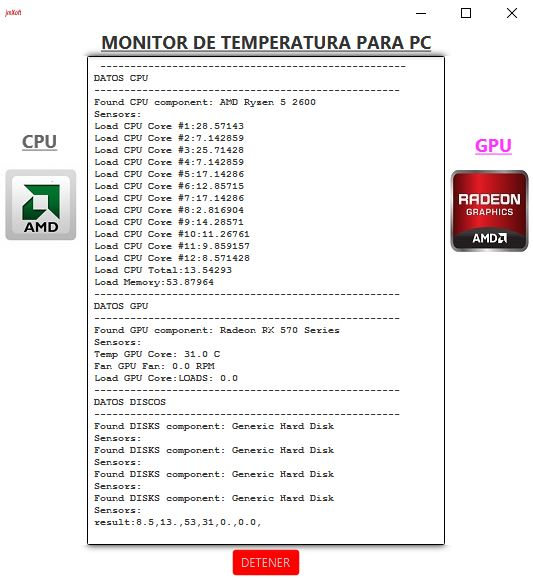

# JAVA-CPU-TEMP
Monitor de temperatura de CPU GPU y DISCOS
El siguiente progra esta hecho en javaFx y nos muestra las temperaturas del cpu , gpu y discos con sus respectivas rpm de los coolers de la cpu y gpu.
Tambien nos muestra el uso de la memoria ram  y tiene la dispobinilidad de transmitir los datos por puerto serie COM9 el cual siqueremos colocar alguna placa de Arduino o receptora de datos podemos monitorizarlos tambien.
EL progrma esta hecho con la version de java jdk1.8.0_241 para Windows all 64bits
# Fuentes de datos disponibles:
https://github.com/profesorfalken/jSensors
# Imagenes:

# ARDUINO CPU TEMPERATURA DISPLAY
El cliente de conexion arduino recibe datos por el puerto serie COM9 y los retransmite al display de crystal liquido.
EL codigo esta diseñado en lenguaje c y se encuentra en la carpeta ARDUINO_TEMP
la placa que se utilizo fue la arduino uno.
# Imagenes display Arduino:

